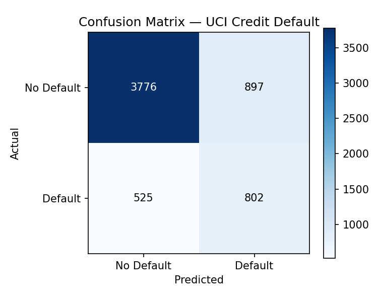
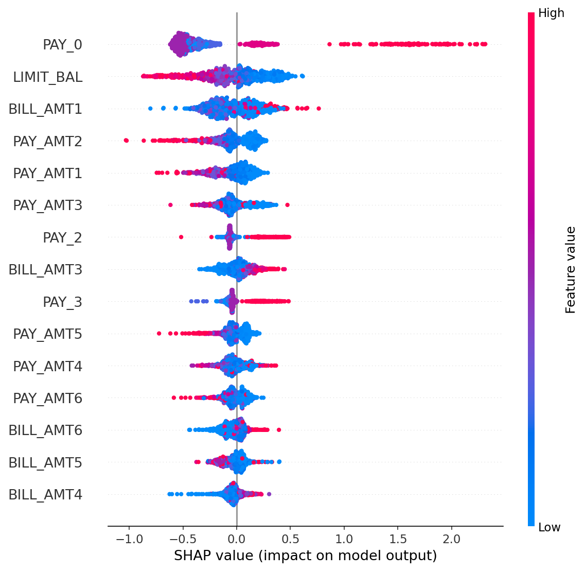

# M3 — Loan Default Predictor

Credit-default classifier with explainability. Trained on the **UCI Credit Card Default** dataset (30,000 borrowers, Taiwan, 2005). XGBoost + SHAP. Reproducible with `random_state=42`.

> Honest framing: this is a portfolio project for a Business Law student's resume. Not a production credit decision system. No fairness / adverse-action controls beyond what the dataset documents.

## Demo



```text
$ python scripts/run_pipeline.py
Holdout AUC: 0.7732   |   5-fold CV AUC: 0.7802
Precision (default=1): 0.4720   Recall: 0.6044   F1: 0.5301
Confusion matrix    pred=0   pred=1
  actual=0          3776       897
  actual=1           525       802
```

Full output: [`docs/cli-demo.txt`](docs/cli-demo.txt) | More plots: [`docs/shap_summary.png`](docs/shap_summary.png), [`docs/shap_waterfall.png`](docs/shap_waterfall.png)

---

## Problem

Predict whether a credit-card borrower will default on next month's payment, using demographic features, credit limit, and a 6-month history of repayment status, bill amounts, and payments.

## Dataset

- **Source**: [UCI Machine Learning Repository — Default of Credit Card Clients](https://archive.ics.uci.edu/ml/machine-learning-databases/00350/default%20of%20credit%20card%20clients.xls)
- **Rows**: 30,000
- **Features**: 23 (after dropping `ID`) — credit limit, sex, education, marriage, age, repayment status `PAY_0..PAY_6`, bill amounts `BILL_AMT1..6`, payments `PAY_AMT1..6`
- **Target**: `default_next_month` ∈ {0, 1}, base rate ≈ 22.1%
- **License**: public, no auth required

The loader caches a cleaned CSV at `data/uci_credit_default.csv` so subsequent runs skip the `.xls` parse step.

### Fallback

If the UCI direct download fails (host occasionally rate-limits), drop a copy of `default of credit card clients.xls` into `data/` manually — the loader will pick it up.

## Approach

1. Load + clean the .xls (promote real header row, drop `ID`, drop NaNs, type-coerce).
2. Stratified 80/20 train/test split, `random_state=42`.
3. XGBoost (`tree_method="hist"`, depth 5, 400 trees, `lr=0.05`), `scale_pos_weight` set from class imbalance.
4. Holdout metrics + 5-fold stratified CV AUC (unweighted base model, honest baseline).
5. SHAP `TreeExplainer` for global beeswarm + per-borrower waterfall plots.

## Results

Run `python scripts/run_pipeline.py` to reproduce.

| metric                | value  |
|-----------------------|--------|
| Holdout AUC           | 0.773  |
| 5-fold CV AUC         | 0.780  |
| Precision (default=1) | 0.472  |
| Recall (default=1)    | 0.604  |
| F1 (default=1)        | 0.530  |
| Accuracy              | 0.763  |

Target was AUC > 0.75 — **achieved**.

### Top SHAP features (mean |SHAP|)

| rank | feature      | meaning                              |
|------|--------------|--------------------------------------|
| 1    | `PAY_0`      | most recent repayment status         |
| 2    | `LIMIT_BAL`  | credit limit                         |
| 3    | `BILL_AMT1`  | most recent bill amount              |
| 4    | `PAY_AMT2`   | payment two months ago               |
| 5    | `PAY_AMT1`   | most recent payment                  |

`PAY_0` dominates — current delinquency is the strongest signal, consistent with credit-default literature.

### Plots




## How to run

Requires Python 3.12+ and (on macOS) `libomp` for XGBoost: `brew install libomp`.

```bash
git clone https://github.com/ypatel39-commits/m3-loan-default.git
cd m3-loan-default
python3.12 -m venv .venv
source .venv/bin/activate
pip install -e ".[dev]"

# end-to-end pipeline + refresh PNGs in docs/
python scripts/run_pipeline.py

# tests
pytest -v

# interactive demo
jupyter lab notebooks/01_demo.ipynb
```

## Layout

```
src/m3_loan_default/
  data.py       # download + clean UCI .xls
  model.py      # XGBoost train/eval + 5-fold CV
  explain.py    # SHAP TreeExplainer + plots
scripts/
  run_pipeline.py
notebooks/
  01_demo.ipynb
tests/
  test_data.py test_model.py test_explain.py test_smoke.py
docs/
  confusion_matrix.png shap_summary.png shap_waterfall.png metrics.json
```

## Author

Yash Patel — Tempe, AZ — Business Law student building a quant/finance portfolio.
GitHub: [ypatel39-commits](https://github.com/ypatel39-commits)
